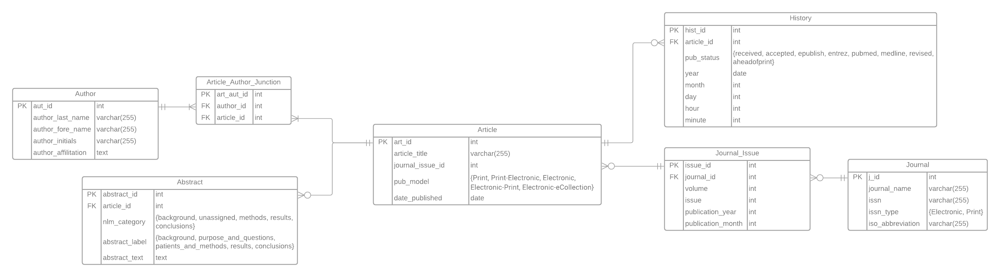

# Load Packages

```{r}
library(DBI)
library(RMySQL)
library(XML)

library(sqldf)
options(sqldf.driver = "SQLite")   ## Setting needed to use sqldf with non sqlite database

library(dplyr)    ## For removing duplicate values in dataframe
library(stringr)  ## For capitalization
```

## Connect to AWS

```{r}
db_user <- "dbadmin"
db_name <- 'SandboxDB'
db_password <- "dos8JINT.kras8jaun"
db_host <- "cs5200-dbs.ctuc7sl6qeau.us-east-2.rds.amazonaws.com"
db_port <- 3306

dbcon <- dbConnect(MySQL(), dbname = db_name, host = db_host, 
                   port = db_port, user = db_user, password = db_password)
```

```{r}
# View tables in the database
dbListTables(dbcon)
```

```{sql connection=mydb}
-- Turns off foreign key check
SET FOREIGN_KEY_CHECKS = 0;
```

# ERD

 <https://lucid.app/lucidchart/5a835436-ec1a-461a-94d4-bd4d46ece96f/edit?viewport_loc=-1125%2C-339%2C8042%2C3233%2CqB62~LJfXzY6&invitationId=inv_2685f3e2-beaf-4ddd-808d-a2ccd6c89094>

# Create Tables

## AUTHOR

```{sql connection=dbcon}
DROP TABLE IF EXISTS Author;
```

```{sql connection=dbcon}
CREATE TABLE Author (
  aut_id INT PRIMARY KEY autoincrement,
  author_last_name VARCHAR(255) NOT NULL,
  author_fore_name VARCHAR(255) NOT NULL,
  author_initials VARCHAR(255),
  author_affilitation TEXT -- TODO: changed blob to TEXT
);
```

```{sql connection=dbcon}
SELECT * FROM Author;
```

## ARTICLE

```{sql connection=dbcon}
DROP TABLE IF EXISTS Article;
```

```{sql connection=dbcon}
CREATE TABLE Article (
  art_id` INT PRIMARY KEY autoincrement,
  article_title VARCHAR(255) NOT NULL,
  journal_issue_id INT NOT NULL,
  pub_model ENUM('Print', 'Print-Electronic', 'Electronic', 'Electronic-Print', 'Electronic-eCollection') NOT NULL,
);
```

```{sql connection=dbcon}
SELECT * FROM Article;
```

## ABSTRACT

```{sql connection=dbcon}
DROP TABLE IF EXISTS Abstract;
```

```{sql connection=dbcon}
CREATE TABLE Abstract (
  abstract_id INT PRIMARY KEY autoincrement,
  article_id INT NOT NULL,
  nlm_category ENUM('background', 'unassigned', 'methods', 'results', 'conclusions') NOT NULL,
  abstract_label ENUM('background', 'purpose_and_questions', 'patients_and_methods', 'results', 'conclusions') NOT NULL,
  abstract_text TEXT, -- TODO: changed blob to TEXT
  
  CONSTRAINT article_id_fk FOREIGN KEY (article_id) REFERENCES Article(art_id)
);
```

```{sql connection=dbcon}
SELECT * FROM Abstract;
```

## ARTICLE AUTHOR JUNCTION

```{sql connection=dbcon}
DROP TABLE IF EXISTS Article_Author_Junction;
```

```{sql connection=dbcon}
CREATE TABLE Article_Author_Junction (
  art_aut_id INT PRIMARY KEY autoincrement,
  author_id INT NOT NULL,
  article_id INT NOT NULL,
  
  CONSTRAINT author_id_fk FOREIGN KEY (author_id) REFERENCES Author(aut_id),
  CONSTRAINT article_id_fk FOREIGN KEY (article_id) REFERENCES Article(art_id)
);
```

```{sql connection=dbcon}
SELECT * FROM Article_Author_Junction;
```

## HISTORY

```{sql connection=dbcon}
DROP TABLE IF EXISTS History;
```

```{sql connection=dbcon}
CREATE TABLE History (
  hist_id INT PRIMARY KEY autoincrement,
  article_id INT NOT NULL,
  pub_status ENUM('received', 'accepted', 'epublish', 'entrez', 'pubmed', 'medline', 'revised', 'aheadofprint') NOT NULL,
  year DATE NOT NULL,
  month INT NOT NULL,
  day INT NOT NULL,
  hour INT NOT NULL,
  minute INT NOT NULL,
  
  CONSTRAINT article_id_fk FOREIGN KEY (article_id) REFERENCES Article(art_id)
);
```

```{sql connection=dbcon}
SELECT * FROM History;
```

## JOURNAL

```{sql connection=dbcon}
DROP TABLE IF EXISTS Journal;
```

```{sql connection=dbcon}
CREATE TABLE Journal (
  j_id INT PRIMARY KEY autoincrement,
  journal_name VARCHAR(255) NOT NULL,
  issn VARCHAR(255) NOT NULL,
  issn_type ENUM('Electronic', 'Print') NOT NULL,
  iso_abbreviation VARCHAR(255) NOT NULL
  );
```

```{sql connection=dbcon}
SELECT * FROM Journal;
```

## JOURNAL_ISSUE

```{sql connection=dbcon}
DROP TABLE IF EXISTS Journal_Issue;
```

```{sql connection=dbcon}
CREATE TABLE Journal_Issue (
  issue_id INT PRIMARY KEY autoincrement,
  journal_id INT NOT NULL,
  volume INT NOT NULL,
  issue INT NOT NULL,
  publication_year INT NOT NULL,
  publication_month INT NOT NULL,
  
  CONSTRAINT journal_id_fk FOREIGN KEY (journal_id) REFERENCES Journal(j_id)
);
```

```{sql connection=dbcon}
SELECT * FROM Journal_Issue;
```

# Helper Functions

## Row Exists

A function to determine if a given row exists in a column. Returns the value of the first column of that row (primary key for that row) if all columns except the first one match, otherwise returns 0.

```{r}
# TODO: Why wouldn't we just combine this with the function below?

rowExists <- function (aRow, aDF){
  # check if that address is already in the data frame
  num_rows <- nrow(aDF)
  num_cols <- ncol(aDF)
  
  if ( num_rows == 0 ){
    # data frame is empty, so can't exist
    return(0)
  }
  
  for ( i in 1:num_rows ){
    
    # check if all columns match for a row
    if ( all(aDF[i,2:ncol(aDF)] == aRow[1,]) ){
      
      # found a match; return it's ID
      return(aDF[i,1])
    }
  }
  
  # none matched
  return(0)
}
```

## Return PK

A function that return ths PK of a tuple from a data frame. This should only be used when the value to be found is in the dataframe, otherwise it will throw an error.

```{r}
returnPK <- function (aRow, aDF){
  # check if that address is already in the data frame
  num_rows <- nrow(aDF)
  num_cols <- ncol(aDF)
  
  if ( num_rows == 0 ){
    # data frame is empty, so can't exist
    stop("Data frame in which value should be stored is empty.")
  }
  
  for ( i in 1:num_rows ){
    
    # check if all columns match for a row
    if ( all(aDF[i,2:ncol(aDF)] == aRow[1,]) ){
      
      # found a match; return it's ID
      return(aDF[i,1])
    }
  }
  
  # none matched
  stop("Value could not be found in data frame.")
}
```

## monthYear

A function that converts a three character string, "MAR", to the correct month number. Returns NA if value passed in is NA. Throws an error if the entered VARCHAR(255) is not valid.

```{r}
monthYear <- function(month_text){
  standardized_month_text <- toupper(month_text)
  if ( is.na(standardized_month_text) ) return(NA)
  else if ( standardized_month_text == "JAN" ) return(1)
  else if ( standardized_month_text == "FEB" ) return (2)
  else if ( standardized_month_text == "MAR" ) return (3)
  else if ( standardized_month_text == "APR" ) return (4)
  else if ( standardized_month_text == "MAY" ) return (5)
  else if ( standardized_month_text == "JUN" ) return (6)
  else if ( standardized_month_text == "JUL" ) return (7)
  else if ( standardized_month_text == "AUG" ) return (8)
  else if ( standardized_month_text == "SEP" ) return (9)
  else if ( standardized_month_text == "OCT" ) return (10)
  else if ( standardized_month_text == "NOV" ) return (11)
  else if ( standardized_month_text == "DEC" ) return (12)
  stop("Month text not found. Could not convert to number.")
}
```

## Create Data Frames

```{r}
author.df <- data.frame(aut_id <- as.numeric(),
                        author_last_name <- as.character(),
                        author_fore_name <- as.character(),
                        author_initlas <- as.character(),
                        stringsAsFactors = FALSE)

abstract.df <- data.frame(abstract_id <- as.numeric(),
                          article_id <- as.numeric(),
                          nlm_category <- as.character(),
                          abstract_label <- as.character(),
                          abstract_text <- as.character(),
                          stringsAsFactors = FALSE)

article_author_junction.df <- data.frame(art_aut_id <- as.numeric(),
                                         author_id <- as.numeric(),
                                         article_id <- as.numeric(),
                                         stringsAsFactors = FALSE)

article.df <- data.frame(art_id <- as.numeric(),
                         article_title <- as.character(),
                         journal_issue_id <- as.numeric(),
                         pub_model <- as.character(),
                         stringsAsFactors = FALSE)

history.df <- data.frame(hist_id <- as.numeric(),
                         article_id <- as.numeric(),
                         pub_status <- as.character(),
                         year <- as.numeric(),
                         month <- as.numeric(),
                         day <- as.numeric(),
                         stringsAsFactors = FALSE)

journal_issue.df <- data.frame(issue_id <- as.numeric(),
                               journal_id <- as.numeric(),
                               volume <- as.numeric(),
                               issue <- as.numeric(),
                               publication_year <- as.numeric(),
                               publication_month <- as.numeric(),
                               stringsAsFactors = FALSE)

journal.df <- data.frame(j_id <- as.numeric(),
                         journal_name <- as.character(),
                         issn <- as.character(),
                         issn_type <- as.character(),
                         iso_abbreviation <- as.character(),
                         stringsAsFactors = FALSE)
```

# Load Data

## Parse XML Document

```{r}
fn <- "pubmed_sample.xml"

# Reading XML file and parse into DOM
xmlDOM <- xmlParse(file = fn) 

# gGt root node 
r <- xmlRoot(xmlDOM) 

# Get number of articles in XML file
numArticles <- xmlSize(r) 
```

## Parse Article Information

```{r}
# Looping through all of the articles
for ( i in 1:numArticles ){
  
  # parse first article
  article <- r[[i]]

  # ------------------- #
  # Journal Information #
  # ------------------- #
  
  # Journal Title
  journalTitleQuery <- "./MedlineCitation/Article/Journal/Title"
  journalTitle <- xpathSApply(article, journalTitleQuery, xmlValue)

  # Journal Abbreviation
  journalAbbreviationQuery <- "./MedlineCitation/Article/Journal/ISOAbbreviation"
  journalAbbreviation <- xpathSApply(article, journalAbbreviationQuery, xmlValue)
  
  # ISSN ID
  journalISSNQuery <- "./MedlineCitation/Article/Journal/ISSN"
  journalISSN <- xpathSApply(article, journalISSNQuery, xmlValue)
  
  # ISSN Type
  journalIssnTypeQuery <- "./MedlineCitation/Article/Journal/ISSN/@IssnType"
  journalIssnType <- xpathSApply(article, journalIssnTypeQuery)

  # Create temporary data frame to store new journal information
  a.journal <- data.frame(str_to_title(journalTitle), journalISSN,
                          journalIssnType, journalAbbreviation, 
                          stringsAsFactors = FALSE)
  
  # Check to see if journal already exists in journal.df
  journalID <- rowExists(a.journal, journal.df)
  
  # If journal doesn't exist, add it to the data frame
  if ( journalID == 0 ){
    
    # Set journalID to be the next unused row num in journal.df
    journalID <- nrow(journal.df) + 1
    
    # TODO: TBH, I don't understand why the first line isn't sufficient
    journal.df[journalID,2:ncol(journal.df)] <- a.journal
    journal.df[journalID, 1] <- journalID
  }
  
  # ------------- #
  # Journal Issue #
  # ------------- #

  # Volume
  journalVolumeQuery <- "./MedlineCitation/Article/Journal/JournalIssue/Volume"
  journalVolume <- xpathSApply(article, journalVolumeQuery, xmlValue)
  
  # Issue
  journalIssueQuery <- "./MedlineCitation/Article/Journal/JournalIssue/Issue"
  journalIssue <- xpathSApply(article, journalIssueQuery, xmlValue)

  # Parse out publication data section of XML document
  publicationDataQuery <- "./MedlineCitation/Article/Journal/JournalIssue/PubDate"
  publicationData <- xpathSApply(article, publicationDataQuery)
  
  # Need to parse date differently: can be stored as MedlineDate or Month/Date
  if ( (xmlName(publicationData[[1]][[1]]) == 'MedlineDate') ) {
    
    ## if it is saved as MedlineDate, use substring to extract year and month
    journalIssueYearQuery <- "substring(./MedlineCitation/Article/Journal/JournalIssue/PubDate/MedlineDate,1, 4)"
    journalIssueYear <- xpathSApply(article, journalIssueYearQuery, xmlValue)
    
    journalIssueMonthQuery <- "substring(./MedlineCitation/Article/Journal/JournalIssue/PubDate/MedlineDate, 6, 3)"
    journalIssueMonth <- xpathSApply(article, journalIssueMonthQuery, xmlValue)
    
    # Use function to convert VARCHAR(255) month to numeric
    journalIssueMonth <- monthYear(journalIssueMonth)
  } 
  
  ## If it is not saved as Medline, parse out Year and Month
  else{
    journalIssueYear <- NA
    journalIssueMonth <- NA
    
    # Because not every article has a pub month, using a for loop with xmlName to extract the data
    
    for ( j in 1:xmlSize(publicationData[[1]]) ){
      
      ## If year is found, save year so it isn't NA
      if ( xmlName(publicationData[[1]][[j]]) == 'Year' ){
        journalIssueYear <- xmlValue(publicationData[[1]][[j]])
      }
      
      ## If month is found, save so it isn't NA
      if ( xmlName(publicationData[[1]][[j]]) == 'Month' ){
        journalIssueMonth <- xmlValue(publicationData[[1]][[j]])
        
        # Use function to convert VARCHAR(255) month to numeric
        journalIssueMonth <- monthYear(journalIssueMonth)
      }
    }
  }
  
  # Check to see if journal issue is already saved
  an.issue <- data.frame(journalID, journalVolume, journalIssue,
                         journalIssueYear, journalIssueMonth,
                         stringsAsFactors = FALSE)

  issueID <- rowExists(an.issue, journal_issue.df)
  
  # If journal issue doesn't exist, add it to the data frame
  if ( issueID == 0 ){
    
    # Set issue_id to be the next unused row num in journal_issue.df
    issueID <- nrow(journal_issue.df) + 1
    
    # TODO: TBH, I don't understand why the first line isn't sufficient
    journal_issue.df[issueID,2:ncol(journal_issue.df)] <- an.issue
    journal_issue.df[issueID, 1] <- issueID
  }
  
  # -------- #
  # Articles #
  # -------- #
  
  # Article Title
  articleTitleQuery <- "./MedlineCitation/Article/ArticleTitle"
  articleTitle <- xpathSApply(article, articleTitleQuery, xmlValue)
  
  pubModelQuery <- "./MedlineCitation/Article/@PubModel"
  pubModel <- xpathSApply(article, pubModelQuery)
  
  an.article <- data.frame(articleTitle, journalID, pubModel)
  
  articleID <- rowExists(an.article, article.df)
  
  # If journal issue doesn't exist, add it to the data frame
  if ( articleID == 0 ){
    
    # Set issue_id to be the next unused row num in journal_issue.df
    articleID <- nrow(article.df) + 1
    
    # TODO: TBH, I don't understand why the first line isn't sufficient
    article.df[articleID,2:ncol(article.df)] <- an.article
    article.df[articleID, 1] <- articleID
  }
  
  # ------- #
  # Authors #
  # ------- #
  authorsQuery <- "./MedlineCitation/Article/AuthorList/Author"
  authorsResultSet <- xpathSApply(article, authorsQuery)

  # Loop through the AuthorsSet, extracting info and adding to authors table
  for ( j in 1:xmlSize(authorsResultSet) ){
    
    author <- authorsResultSet[[j]]
    last_name <- str_to_title(xmlValue(author[[1]]))
    fore_name <- str_to_title(xmlValue(author[[2]]))
    initials <- toupper(xmlValue(author[[3]]))

    an.author <- data.frame(last_name, fore_name, initials,
                          stringsAsFactors = FALSE)

    authorID <- rowExists(an.author, author.df)

    # If author doesn't exist, add it to the data frame
    if ( authorID == 0 ){

      # Set authorID to be the next unused row num in author.df
      authorID <- nrow(author.df) + 1

      # TODO: TBH, I don't understand why the first line isn't sufficient
      author.df[authorID,2:ncol(author.df)] <- an.author
      author.df[authorID, 1] <- authorID
    }
    
    # Retrieve next line in the junction table and add linking to author and article
    articleAuthorID <- nrow(article_author_junction.df) + 1
    an.article_author_junction <- data.frame(articleAuthorID, authorID, articleID)
    article_author_junction.df[articleAuthorID,] <- an.article_author_junction
  }
  
  # -------- #
  # Abstract #
  # -------- #

  abstractInfoQuery <- "./MedlineCitation/Article/Abstract/AbstractText"
  abstractInfoDataSet <- xpathSApply(article, abstractInfoQuery)

  # iterate through list of abstract info, create an abstract record and add it
  # to the abstract.df
  for ( j in 1:length(abstractInfoDataSet) ){
    abstractRecord <- abstractInfoDataSet[j]
    label <- xmlAttrs(abstractRecord[[1]])[1]
    nlm <- xmlAttrs(abstractRecord[[1]])[2]
    text <- xmlValue(abstractRecord[[1]])
    
    # TODO: try removing the last is.null
    if ( is.null(label) ) label <- "UNKNOWN"
    if ( is.null(nlm) ) nlm <- "UNKNOWN"
    if ( is.null(text) ) text <- "UNKNOWN"

    abstractID <- nrow(abstract.df) + 1

    an.abstractEntry <- data.frame(abstractID, articleID, nlm, label, text )

    abstract.df[abstractID,] <- an.abstractEntry
  }

  # ------- #
  # History #
  # ------- #
  
  historyDataQuery <- "./PubmedData/History/PubMedPubDate"
  historyDataSet <- xpathSApply(article, historyDataQuery)
  
  for ( j in 1:length(historyDataSet) ){
    historyEntry <- historyDataSet[j]
    publicationStatus <- xmlAttrs(historyEntry[[1]])
    year <- xmlValue(historyEntry[[1]][[1]])
    month <- xmlValue(historyEntry[[1]][[2]])
    day <- xmlValue(historyEntry[[1]][[3]])
    
    historyEntryID <- nrow(history.df) + 1
    
    a.historyEntry <- data.frame(historyEntryID, articleID, publicationStatus, year, month, day)
    history.df[historyEntryID,] <- a.historyEntry
  }
} 

```

# Upload Data

## Prepare Data: Author

```{r}
dbWriteTable(dbcon, "Author", AuthorTable, row.names = FALSE, append = TRUE)
```

## Prepare Data: Article

```{r}
dbWriteTable(dbcon, "Article", ArticleTable, row.names = FALSE, append = TRUE)
```

## Prepare Data: Abstract

```{r}
dbWriteTable(dbcon, "Abstract", AbstractTable, row.names = FALSE, append = TRUE)
```

## Prepare Data: Article Author Junction

```{r}
dbWriteTable(dbcon, "Article_Author_Junction", Article_Author_Juncion_Table, row.names = FALSE, append = TRUE)
```

## Prepare Data: History

```{r}
dbWriteTable(dbcon, "History", HistoryTable, row.names = FALSE, append = TRUE)
```

## Prepare Data: Journal

```{r}
dbWriteTable(dbcon, "Journal", JournalTable, row.names = FALSE, append = TRUE)
```

## Prepare Data: Journal_Issue

```{r}
dbWriteTable(dbcon, "Journal_Issue", Journal_Issue_Table, row.names = FALSE, append = TRUE)
```

```{sql connection=dbcon}
SET FOREIGN_KEY_CHECKS = 1;
```

# Create Star/Snowflake Schema

## (20 pts) Create and populate a star schema with dimension and transaction fact tables. Each row in the fact table will represent one article. Include the image of an updated ERD that contains the fact table and any additional required dimension tables. Populate the star schema in R. When building the schema, look a head to Part 3 as the schema is dependent on the eventual OLAP queries.

## (20 pts) In the same schema as the previous step, create and populate a summary fact table that represents number of articles per time period (quarter, year) by author and by journal. Include the image of an updated ERD that contains the fact table. Populate the fact table in R. When building the schema, look a head to Part 3 as the schema is dependent on the eventual OLAP queries.

# Explore and Mine Data

## (20 pts) Write queries using your data warehouse to explore whether the publications show a seasonal pattern. Look beyond the pattern of number of publications per season. Adjust your fact tables as needed to support your new queries. If you need to update the fact table, document your changes and your reasons why the changes are needed.

```{r}
dbDisconnect(dbcon)
```

# Everything below this line is simply for testing / experimentation

```{r}
# This gets you the article information
r[[15]]
```

```{r}
article <- r[[15]]
  x <- "./MedlineCitation/Article/Abstract/AbstractText"
  history <- xpathSApply(article, x)
  attribute <- xmlValue(history[[1]])
  attribute

```
# SQLDF to check how things are working

```{r}
sqldf('SELECT "author_last_name....as.character..", "author_fore_name....as.character..",
       "article_title....as.character..", ji.*, j.* FROM "article.df" AS a 
       JOIN "article_author_junction.df" AS aj
       ON a."art_id....as.numeric.." = aj."article_id....as.numeric.."
       JOIN "author.df" AS ar
       ON aj."author_id....as.numeric.." = ar."aut_id....as.numeric.."
       JOIN "journal_issue.df" AS ji
       ON "journal_issue_id....as.numeric.." = "issue_id....as.numeric.."
       JOIN "journal.df" AS j
       ON "journal_id....as.numeric.." = "j_id....as.numeric.."')
```


# XPath queries

```{r}
  query <- "//AuthorList/Author/LastName"
  x <- xpathSApply(article, query, xmlValue)
  length(unique(x))
```

# TODOs! 

```{r}
# Most Important TODO
-------------------------------------------------
# TODO: Check this out...super helpful: https://dtd.nlm.nih.gov/ncbi/pubmed/doc/out/180101/

# TODO: bringing in affiliation is causing many duplicates in the author table...do we clean (make all small caps or all big caps) or delete? Could try something like this: https://astrostatistics.psu.edu/su07/R/library/base/html/agrep.html I'm leaning toward deleting...easier. Check out the author.df and the person with the last name Memtsoudis for an example **
  # - I vote remove affiliation
  # - Dropped us to 86 values! I used xpath to extract all author last names and removed duplicates and wound up with 79,
  #   which are likely because of the initial situations....can look at this later, if we want!

# TODO: I'm stuck on published_date for an article. I'm thinking that we possibly remove published_date from the article table. Instead, because each article is linked to a particular journal issue, that is the published date? There is an ArticleDate element, but that is only for articles that were published electronically...some are missing that info.**
  # - Let's try removing the published_date from article table and see if any issues arise

# Less Important TODO
  -----------------------------------------
# TODO: do we need to do indexes? - ugh do we?
# TODO: check for nulls in the create tables - I assigned it to most attributes; pls check~
# TODO: do we want to use str_to_title() to standardize journal titles?
# TODO: we may not use sqldf / could be removed - lets see how it goes
# TODO: the parsing chunk for each article is very long...should probably make some functions
  
# Done TODO
-----------------------------
# put in ERD
# add in NOT NULL, move PRIMARY KEY in line with the attribute, and Foreign Key ConstraINTs
# look at order of table creation **
# update heading information
# add in disable FK constraINTs at beginning and then add in
# DateCreated, DateCompleted, and DateRevised are all connected to the citation - take out of the article table.

```