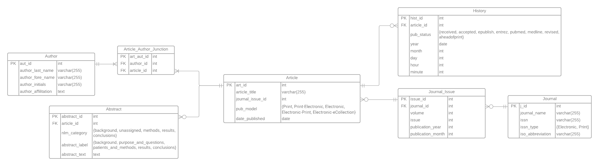
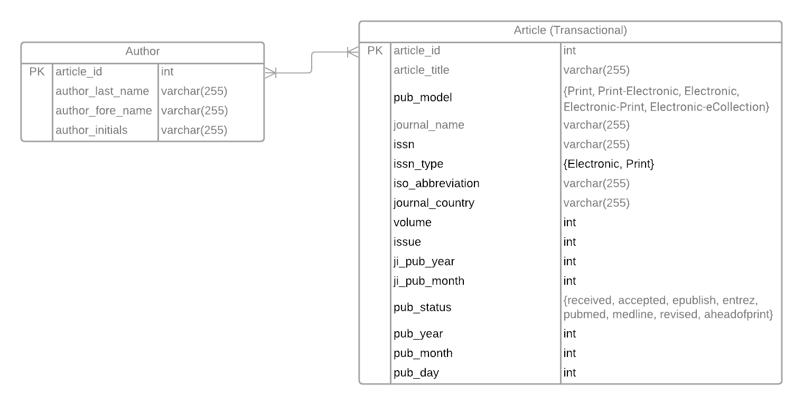

# Load Packages

```{r}
library(DBI)
library(RMySQL)
library(XML)
library(sqldf)
library(dplyr)    ## For removing duplicate values in dataframe
library(stringr)  ## For capitalization
```

## Connect to AWS

```{r}
db_user <- "dbadmin"
db_name <- 'SandboxDB'
db_password <- "dos8JINT.kras8jaun"
db_host <- "cs5200-dbs.ctuc7sl6qeau.us-east-2.rds.amazonaws.com"
db_port <- 3306

dbcon <- dbConnect(MySQL(), dbname = db_name, host = db_host, 
                   port = db_port, user = db_user, password = db_password)
```

```{r}
# View tables in the database
dbListTables(dbcon)
```

```{sql connection=dbcon}
-- Turns off foreign key check
SET FOREIGN_KEY_CHECKS = 0;
```

# ERD

## TODO: Need to double check this ERD

 <https://lucid.app/lucidchart/5a835436-ec1a-461a-94d4-bd4d46ece96f/edit?viewport_loc=-1125%2C-339%2C8042%2C3233%2CqB62~LJfXzY6&invitationId=inv_2685f3e2-beaf-4ddd-808d-a2ccd6c89094>

# Create Tables

## AUTHOR

```{sql connection=dbcon}
DROP TABLE IF EXISTS Author;
```

```{sql connection=dbcon}
CREATE TABLE Author (
  aut_id INT PRIMARY KEY AUTO_INCREMENT,
  author_last_name VARCHAR(255) NOT NULL,
  author_fore_name VARCHAR(255) NOT NULL,
  author_initials VARCHAR(255) NOT NULL
);
```

```{sql connection=dbcon}
SELECT * FROM Author;
```

## ARTICLE

```{sql connection=dbcon}
DROP TABLE IF EXISTS Article;
```

```{sql connection=dbcon}
CREATE TABLE Article (
  art_id INT PRIMARY KEY AUTO_INCREMENT,
  article_title VARCHAR(255) NOT NULL,
  journal_issue_id INT NOT NULL,
  pub_model ENUM('Print', 'Print-Electronic', 'Electronic', 'Electronic-Print', 'Electronic-eCollection') NOT NULL
);
```

```{sql connection=dbcon}
SELECT * FROM Article;
```

## ABSTRACT

```{sql connection=dbcon}
DROP TABLE IF EXISTS Abstract;
```

```{sql connection=dbcon}
CREATE TABLE Abstract (
  abstract_id INT PRIMARY KEY AUTO_INCREMENT,
  article_id INT NOT NULL,
  nlm_category ENUM("BACKGROUND", "UNASSIGNED", "METHODS", "RESULTS",
                    "CONCLUSIONS", "OBJECTIVE", "UNKNOWN") NOT NULL,
  abstract_label ENUM("BACKGROUND","PURPOSE AND QUESTIONS","PATIENTS AND METHODS",
                      "RESULTS","CONCLUSIONS","METHODS","BACKGROUND AND PURPOSE",
                      "BACKGROUND AND OBJECTIVES","PURPOSE","QUESTIONS/PURPOSES",
                      "OBJECTIVE","CONCLUSION","DESIGN","SETTINGS","PATIENTS",
                      "INTERVENTIONS","MAIN OUTCOME MEASURES","STUDY OBJECTIVE",
                      "SETTING","MEASUREMENTS","MAIN RESULTS","STUDY DESIGN",
                      "SUMMARY OF BACKGROUND DATA","INTRODUCTION","UNKNOWN") NOT NULL,
  abstract_text TEXT,
  
  CONSTRAINT article_id_in_abstract_fk FOREIGN KEY (article_id) REFERENCES Article(art_id)
);
```

```{sql connection=dbcon}
SELECT * FROM Abstract;
```

## ARTICLE AUTHOR JUNCTION

```{sql connection=dbcon}
DROP TABLE IF EXISTS Article_Author_Junction;
```

```{sql connection=dbcon}
CREATE TABLE Article_Author_Junction (
  art_aut_id INT PRIMARY KEY AUTO_INCREMENT,
  author_id INT NOT NULL,
  article_id INT NOT NULL,
  
  CONSTRAINT author_id_in_junction_fk FOREIGN KEY (author_id) REFERENCES Author(aut_id),
  CONSTRAINT article_id_fk FOREIGN KEY (article_id) REFERENCES Article(art_id)
);
```

```{sql connection=dbcon}
SELECT * FROM Article_Author_Junction;
```

## HISTORY

```{sql connection=dbcon}
DROP TABLE IF EXISTS History;
```

```{sql connection=dbcon}
CREATE TABLE History (
  hist_id INT PRIMARY KEY AUTO_INCREMENT,
  article_id INT NOT NULL,
  pub_status ENUM('received', 'accepted', 'epublish', 'entrez', 'pubmed', 'medline', 'revised', 'aheadofprint') NOT NULL,
  year INT NOT NULL,
  month INT NOT NULL,
  day INT NOT NULL,
  
  CONSTRAINT article_id_in_history_fk FOREIGN KEY (article_id) REFERENCES Article(art_id)
);
```

```{sql connection=dbcon}
SELECT * FROM History;
```

## JOURNAL

```{sql connection=dbcon}
DROP TABLE IF EXISTS Journal;
```

```{sql connection=dbcon}
CREATE TABLE Journal (
  j_id INT PRIMARY KEY AUTO_INCREMENT,
  journal_name VARCHAR(255) NOT NULL,
  issn VARCHAR(255) NOT NULL,
  issn_type ENUM('Electronic', 'Print') NOT NULL,
  iso_abbreviation VARCHAR(255) NOT NULL,
  journal_country VARCHAR(255) NOT NULL
  );
```

```{sql connection=dbcon}
SELECT * FROM Journal;
```

## JOURNAL_ISSUE

```{sql connection=dbcon}
DROP TABLE IF EXISTS Journal_Issue;
```

```{sql connection=dbcon}
CREATE TABLE Journal_Issue (
  issue_id INT PRIMARY KEY AUTO_INCREMENT,
  journal_id INT NOT NULL,
  volume INT NOT NULL,
  issue INT NOT NULL,
  publication_year INT NOT NULL,
  publication_month INT NOT NULL,
  
  CONSTRAINT journal_id_fk FOREIGN KEY (journal_id) REFERENCES Journal(j_id)
);
```

```{sql connection=dbcon}
SELECT * FROM Journal_Issue;
```

# Helper Functions

## Row Exists

A function to determine if a given row exists in a column. Returns the value of the first column of that row (primary key for that row) if all columns except the first one match, otherwise returns 0.

```{r}
rowExists <- function (aRow, aDF){
  # check if that address is already in the data frame
  num_rows <- nrow(aDF)
  num_cols <- ncol(aDF)
  
  if ( num_rows == 0 ){
    # data frame is empty, so can't exist
    return(0)
  }
  
  for ( i in 1:num_rows ){
    
    # check if all columns match for a row
    if ( all(aDF[i,2:ncol(aDF)] == aRow[1,]) ){
      
      # found a match; return it's ID
      return(aDF[i,1])
    }
  }
  
  # none matched
  return(0)
}
```

## monthYear

A function that converts a three character string, "MAR", to the correct month number. Returns NA if value passed in is NA. Throws an error if the entered VARCHAR(255) is not valid.

```{r}
monthYear <- function(month_text){
  standardized_month_text <- toupper(month_text)
  if ( is.na(standardized_month_text) ) return(NA)
  else if ( standardized_month_text == "JAN" ) return(1)
  else if ( standardized_month_text == "FEB" ) return (2)
  else if ( standardized_month_text == "MAR" ) return (3)
  else if ( standardized_month_text == "APR" ) return (4)
  else if ( standardized_month_text == "MAY" ) return (5)
  else if ( standardized_month_text == "JUN" ) return (6)
  else if ( standardized_month_text == "JUL" ) return (7)
  else if ( standardized_month_text == "AUG" ) return (8)
  else if ( standardized_month_text == "SEP" ) return (9)
  else if ( standardized_month_text == "OCT" ) return (10)
  else if ( standardized_month_text == "NOV" ) return (11)
  else if ( standardized_month_text == "DEC" ) return (12)
  stop("Month text not found. Could not convert to number.")
}
```

## parseJournalInfo

Takes an article_node and extracts needed information to add to article.df

```{r}
parseJournalInfo <- function(article_node){
  # Journal Title
  journalTitleQuery <- "./MedlineCitation/Article/Journal/Title"
  journalTitle <- xpathSApply(article_node, journalTitleQuery, xmlValue)

  # Journal Abbreviation
  journalAbbreviationQuery <- "./MedlineCitation/Article/Journal/ISOAbbreviation"
  journalAbbreviation <- xpathSApply(article_node, journalAbbreviationQuery, xmlValue)
  
  # ISSN ID
  journalISSNQuery <- "./MedlineCitation/Article/Journal/ISSN"
  journalISSN <- xpathSApply(article_node, journalISSNQuery, xmlValue)
  
  # ISSN Type
  journalIssnTypeQuery <- "./MedlineCitation/Article/Journal/ISSN/@IssnType"
  journalIssnType <- xpathSApply(article_node, journalIssnTypeQuery)

  # Journal Country
  journalCountryQuery <- "./MedlineCitation/MedlineJournalInfo/Country"
  journalCountry <- xpathSApply(article_node, journalCountryQuery, xmlValue)
  
  # Create temporary data frame to store new journal information
  a.journal <- data.frame(str_to_title(journalTitle), journalISSN,
                          journalIssnType, journalAbbreviation, 
                          journalCountry, stringsAsFactors = FALSE)
  
  return(a.journal)
}
```

## parseJournalIssueInfo

Takes an article_node and journal_id and extracts needed information to add to journal.df

```{r}
parseJournalIssueInfo <- function(journal_id, article_node){
  # Volume
  journalVolumeQuery <- "./MedlineCitation/Article/Journal/JournalIssue/Volume"
  journalVolume <- xpathSApply(article_node, journalVolumeQuery, xmlValue)
  
  # Issue
  journalIssueQuery <- "./MedlineCitation/Article/Journal/JournalIssue/Issue"
  journalIssue <- xpathSApply(article_node, journalIssueQuery, xmlValue)

  # Parse out publication data section of XML document
  publicationDataQuery <- "./MedlineCitation/Article/Journal/JournalIssue/PubDate"
  publicationData <- xpathSApply(article_node, publicationDataQuery)
  
  # Need to parse date differently: can be stored as MedlineDate or Month/Date
  if ( (xmlName(publicationData[[1]][[1]]) == 'MedlineDate') ) {
    
    ## if it is saved as MedlineDate, use substring to extract year and month
    journalIssueYearQuery <- "substring(./MedlineCitation/Article/Journal/JournalIssue/PubDate/MedlineDate,1, 4)"
    journalIssueYear <- xpathSApply(article_node, journalIssueYearQuery, xmlValue)
    
    journalIssueMonthQuery <- "substring(./MedlineCitation/Article/Journal/JournalIssue/PubDate/MedlineDate, 6, 3)"
    journalIssueMonth <- xpathSApply(article_node, journalIssueMonthQuery, xmlValue)
    
    # Use function to convert text month to numeric
    journalIssueMonth <- monthYear(journalIssueMonth)
  } 
  
  ## If it is not saved as Medline, parse out Year and Month
  else{
    
    # if month doesn't exist, set it equal to 1
    journalIssueYear <- 1
    journalIssueMonth <- 1
    
    # Because not every article has a pub month, using a for loop with xmlName to extract the data
    
    for ( j in 1:xmlSize(publicationData[[1]]) ){
      
      ## If year is found, save year so it isn't NA
      if ( xmlName(publicationData[[1]][[j]]) == 'Year' ){
        journalIssueYear <- xmlValue(publicationData[[1]][[j]])
      }
      
      ## If month is found, save so it isn't NA
      if ( xmlName(publicationData[[1]][[j]]) == 'Month' ){
        journalIssueMonth <- xmlValue(publicationData[[1]][[j]])
        
        # Use function to convert text month to numeric
        journalIssueMonth <- monthYear(journalIssueMonth)
      }
    }
  }
  
    an.issue <- data.frame(journal_id, journalVolume, journalIssue,
                         journalIssueYear, journalIssueMonth,
                         stringsAsFactors = FALSE)
  
  return(an.issue)
}
```

```{r}
parseArticleInfo <- function(journal_id, article_node){
  # Article Title
  articleTitleQuery <- "./MedlineCitation/Article/ArticleTitle"
  articleTitle <- xpathSApply(article_node, articleTitleQuery, xmlValue)
  
  # Pub Model
  pubModelQuery <- "./MedlineCitation/Article/@PubModel"
  pubModel <- xpathSApply(article_node, pubModelQuery)
  
  an.article <- data.frame(articleTitle, journal_id, pubModel)
  
  return(an.article)
}
```

## Create Data Frames

```{r}
author.df <- data.frame(aut_id = integer(),
                        author_last_name = character(),
                        author_fore_name = character(),
                        author_initials = character(),
                        stringsAsFactors = FALSE)

abstract.df <- data.frame(abstract_id = integer(),
                          article_id = integer(),
                          nlm_category = character(),
                          abstract_label = character(),
                          abstract_text = character(),
                          stringsAsFactors = FALSE)

article_author_junction.df <- data.frame(art_aut_id = integer(),
                                         author_id = integer(),
                                         article_id = integer(),
                                         stringsAsFactors = FALSE)

article.df <- data.frame(art_id = integer(),
                         article_title = character(),
                         journal_issue_id = integer(),
                         pub_model = character(),
                         stringsAsFactors = FALSE)

history.df <- data.frame(hist_id = integer(),
                         article_id = integer(),
                         pub_status = character(),
                         year = integer(),
                         month = integer(),
                         day = integer(),
                         stringsAsFactors = FALSE)

journal_issue.df <- data.frame(issue_id = integer(),
                               journal_id = integer(),
                               volume = integer(),
                               issue = integer(),
                               publication_year = integer(),
                               publication_month = integer(),
                               stringsAsFactors = FALSE)

journal.df <- data.frame(j_id = integer(),
                         journal_name = character(),
                         issn = character(),
                         issn_type = character(),
                         iso_abbreviation = character(),
                         journal_country = character(),
                         stringsAsFactors = FALSE)
```

# Load Data

## Parse XML Document

```{r}
fn <- "pubmed_sample.xml"

# Reading XML file and parse into DOM
xmlDOM <- xmlParse(file = fn) 

# gGt root node 
r <- xmlRoot(xmlDOM) 

# Get number of articles in XML file
numArticles <- xmlSize(r) 
```

## Parse Article Information

```{r}
# Looping through all of the articles
for ( i in 1:numArticles ){
  
  # parse first article
  article <- r[[i]]

  # ------------------- #
  # Journal Information #
  # ------------------- #
  
  a.journal <- parseJournalInfo(article)
  
  # Check to see if journal already exists in journal.df
  journalID <- rowExists(a.journal, journal.df)
  
  # If journal doesn't exist, add it to the data frame
  if ( journalID == 0 ){
    
    # Set journalID to be the next unused row num in journal.df
    journalID <- nrow(journal.df) + 1
    
    # add record to data frame
    journal.df[journalID,2:ncol(journal.df)] <- a.journal
    journal.df[journalID, 1] <- journalID
  }
  
  # ------------- #
  # Journal Issue #
  # ------------- #

  an.issue <- parseJournalIssueInfo(journalID, article)
  
  issueID <- rowExists(an.issue, journal_issue.df)
  
  # If journal issue doesn't exist, add it to the data frame
  if ( issueID == 0 ){
    
    # Set issue_id to be the next unused row num in journal_issue.df
    issueID <- nrow(journal_issue.df) + 1
    
    # add record to data frame
    journal_issue.df[issueID,2:ncol(journal_issue.df)] <- an.issue
    journal_issue.df[issueID, 1] <- issueID
  }
  
  # -------- #
  # Articles #
  # -------- #
  
  an.article <- parseArticleInfo(journalID, article)
  
  articleID <- rowExists(an.article, article.df)
  
  # If journal issue doesn't exist, add it to the data frame
  if ( articleID == 0 ){
    
    # Set issue_id to be the next unused row num in journal_issue.df
    articleID <- nrow(article.df) + 1
    
    # add record to data frame
    article.df[articleID,2:ncol(article.df)] <- an.article
    article.df[articleID, 1] <- articleID
  }
  
  # ------- #
  # Authors #
  # ------- #
  
  authorsQuery <- "./MedlineCitation/Article/AuthorList/Author"
  authorsResultSet <- xpathSApply(article, authorsQuery)

  # Loop through the AuthorsSet, extracting info and adding to authors table
  for ( j in 1:xmlSize(authorsResultSet) ){
    
    author <- authorsResultSet[[j]]
    last_name <- str_to_title(xmlValue(author[[1]]))
    fore_name <- str_to_title(xmlValue(author[[2]]))
    initials <- toupper(xmlValue(author[[3]]))

    an.author <- data.frame(last_name, fore_name, initials,
                          stringsAsFactors = FALSE)

    authorID <- rowExists(an.author, author.df)

    # If author doesn't exist, add it to the data frame
    if ( authorID == 0 ){

      # Set authorID to be the next unused row num in author.df
      authorID <- nrow(author.df) + 1

      # add record to data frame
      author.df[authorID,2:ncol(author.df)] <- an.author
      author.df[authorID, 1] <- authorID
    }
    
    # Retrieve next line in the junction table and add linking to author and article
    articleAuthorID <- nrow(article_author_junction.df) + 1
    an.article_author_junction <- data.frame(articleAuthorID, authorID, articleID)
    article_author_junction.df[articleAuthorID,] <- an.article_author_junction
  }
  
  # -------- #
  # Abstract #
  # -------- #

  abstractInfoQuery <- "./MedlineCitation/Article/Abstract/AbstractText"
  abstractInfoDataSet <- xpathSApply(article, abstractInfoQuery)

  # iterate through list of abstract info, create an abstract record and add it
  # to the abstract.df
  for ( j in 1:length(abstractInfoDataSet) ){
    abstractRecord <- abstractInfoDataSet[j]
    label <- xmlAttrs(abstractRecord[[1]])[1]
    nlm <- xmlAttrs(abstractRecord[[1]])[2]
    text <- xmlValue(abstractRecord[[1]])
    
    # if any of the data is not found, set it to UNKNOWN
    if ( is.null(label) ) label <- "UNKNOWN"
    if ( is.null(nlm) ) nlm <- "UNKNOWN"
    if ( is.null(text) ) text <- "UNKNOWN"

    abstractID <- nrow(abstract.df) + 1

    an.abstractEntry <- data.frame(abstractID, articleID, nlm, label, text )

    abstract.df[abstractID,] <- an.abstractEntry
  }

  # ------- #
  # History #
  # ------- #
  
  historyDataQuery <- "./PubmedData/History/PubMedPubDate"
  historyDataSet <- xpathSApply(article, historyDataQuery)
  
  for ( j in 1:length(historyDataSet) ){
    historyEntry <- historyDataSet[j]
    publicationStatus <- xmlAttrs(historyEntry[[1]])
    year <- xmlValue(historyEntry[[1]][[1]])
    month <- xmlValue(historyEntry[[1]][[2]])
    day <- xmlValue(historyEntry[[1]][[3]])
    
    historyEntryID <- nrow(history.df) + 1
    
    # add to df
    a.historyEntry <- data.frame(historyEntryID, articleID, publicationStatus, 
                                 year, month, day)
    history.df[historyEntryID,] <- a.historyEntry
  }
} 

```

# Upload Data

## Prepare Data: Author

```{r}
dbWriteTable(dbcon, "Author", author.df, row.names = FALSE, append = TRUE)
```

## Prepare Data: Article

```{r}
dbWriteTable(dbcon, "Article", article.df, row.names = FALSE, append = TRUE)
```

## Prepare Data: Abstract

```{r}
dbWriteTable(dbcon, "Abstract", abstract.df, row.names = FALSE, append = TRUE)
```

## Prepare Data: Article Author Junction

```{r}
dbWriteTable(dbcon, "Article_Author_Junction", article_author_junction.df, row.names = FALSE, append = TRUE)
```

## Prepare Data: History

```{r}
dbWriteTable(dbcon, "History", history.df, row.names = FALSE, append = TRUE)
```

## Prepare Data: Journal

```{r}
dbWriteTable(dbcon, "Journal", journal.df, row.names = FALSE, append = TRUE)
```

## Prepare Data: Journal_Issue

```{r}
dbWriteTable(dbcon, "Journal_Issue", journal_issue.df, row.names = FALSE, append = TRUE)
```

```{sql connection=dbcon}
SET FOREIGN_KEY_CHECKS = 1;
```

## Queries to see if data is correct

```{sql connection=dbcon}
SELECT article_title
, journal_name
, volume
, issue
, publication_year
, publication_month
FROM Article AS A
JOIN Journal_Issue AS JI
ON A.art_id = JI.issue_id
JOIN Journal AS J
ON JI.journal_id = J.j_id;
```

```{sql connection=dbcon}
SELECT SUBSTRING(article_title, 1, 75) AS ArticleTitle
, COUNT(art_aut_id) As AuthorCount
FROM Article AS A
JOIN Article_Author_Junction AS AJ
ON A.art_id = AJ.article_id
GROUP BY article_title;
```

```{sql connection=dbcon}
SELECT A.article_title, JO.journal_name, J.publication_year, J.publication_month
FROM Article AS A
JOIN Journal_Issue AS J
ON A.journal_issue_id = J.issue_id
JOIN Journal AS JO
ON J.journal_id = JO.j_id
WHERE J.journal_id = 4 AND J.publication_year = 2012
ORDER BY J.publication_month ASC;
```

```{sql connection=dbcon}
SELECT AR.aut_id, CONCAT(AR.author_last_name,", ", AR.author_fore_name) AS AuthorName,
       A.article_title, JO.journal_name, J.publication_year, J.publication_month
FROM Article_Author_Junction AS AJ
JOIN Author AS AR
ON AJ.author_id = AR.aut_id
JOIN Article AS A
ON A.art_id = AJ.article_id
JOIN Journal_Issue AS J
ON A.journal_issue_id = J.issue_id
JOIN Journal AS JO
ON J.journal_id = JO.j_id
WHERE AR.aut_id = 3 AND J.publication_year = 2012
ORDER BY J.publication_month ASC;
```


```{sql connection=dbcon}
SELECT CONCAT(AR.author_last_name,", ", AR.author_fore_name) AS AuthorName
, COUNT(AJ.author_id) AS ArticleCount
FROM Article_Author_Junction AS AJ
JOIN Author AS AR
ON AJ.author_id = AR.aut_id
JOIN Article AS A
ON A.art_id = AJ.article_id
JOIN Journal_Issue AS J
ON A.journal_issue_id = J.issue_id
JOIN Journal AS JO
ON J.journal_id = JO.j_id
WHERE J.publication_year = 2012 AND (J.publication_month >= 10 AND J.publication_month <= 12)
GROUP BY AR.aut_id
ORDER BY ArticleCount DESC;
```

```{sql connection=dbcon}
SELECT SUBSTRING(article_title, 1, 50) AS ArticleTitle
, journal_name
, volume
, issue
, publication_year
, publication_month
, H.pub_status
, H.year
, H.month, H.day
FROM Article AS A
JOIN Journal_Issue AS JI
ON A.art_id = JI.issue_id
JOIN Journal AS J
ON JI.journal_id = J.j_id
JOIN History AS H
ON H.article_id = A.art_id
WHERE A.art_id = 16;
```

```{sql connection=dbcon}
SELECT * FROM Author;
```


```{sql connection=dbcon}
SELECT article_title
, Abstract.*
FROM Article
JOIN Abstract
ON Article.art_id = Abstract.article_id
WHERE Article.art_id = 3;
```

```{sql connection=dbcon}
SELECT article_title
, Author.*
FROM Article
JOIN Article_Author_Junction
ON Article.art_id = Article_Author_Junction.article_id
JOIN Author
ON Article_Author_Junction.author_id = Author.aut_id
WHERE Article.art_id = 3;
```

# Create Star/Snowflake Schema

## (20 pts) Create and populate a star schema with dimension and transaction fact tables. Each row in the fact table will represent one article. Include the image of an updated ERD that contains the fact table and any additional required dimension tables. Populate the star schema in R. When building the schema, look a head to Part 3 as the schema is dependent on the eventual OLAP queries.

## Star Schema - factTable and authorTable

 <https://lucid.app/lucidchart/5a835436-ec1a-461a-94d4-bd4d46ece96f/edit?viewport_loc=-1248%2C-504%2C6656%2C3144%2CgMo3rIrSBrSc&invitationId=inv_2685f3e2-beaf-4ddd-808d-a2ccd6c89094>

```{r}

# TODO: let me know your thoughts on this fact table design. I did it with a transactional focus.

factTable <- dbGetQuery(dbcon, 'SELECT a.art_id as article_id
                                , a.article_title
                                , a.pub_model
                                , j.journal_name
                                , j.issn
                                , j.issn_type
                                , j.iso_abbreviation
                                , j.journal_country
                                , ji.volume 
                                , ji.issue
                                , ji.publication_year as ji_pub_year
                                , ji.publication_month as ji_pub_month
                                , h.pub_status
                                , h.year as pub_year
                                , h.month as pub_month
                                , h.day as pub_day
                                FROM Article a
                                JOIN Journal_Issue ji
                                ON a.journal_issue_id = ji.issue_id
                                JOIN Journal j
                                ON j.j_id = ji.journal_id
                                JOIN History h
                                ON a.art_id = h.article_id;
                                ')

factTable

```

```{r}

# TODO: and here is the helper author table
# TODO: I think we should have article and journal tables as well?

authorTable <- dbGetQuery(dbcon, 'SELECT aaj.article_id
                                  , a.author_last_name as last_name
                                  , a.author_fore_name as fore_name
                                  , a.author_initials as initials
                                  FROM Article_Author_Junction aaj
                                  JOIN Author a
                                  ON a.aut_id = aaj.author_id;
                                  ')

authorTable
```

```{r}

# TODO: mush mash of everything for funzies - not desired so might delete (felt cute, might delete later)

factTable <- dbGetQuery(dbcon, 'SELECT *
                                FROM Article AS A
                                JOIN Article_Author_Junction as AAJ
                                ON AAJ.article_id = A.art_id
                                JOIN Author AS Au
                                ON Au.aut_id = AAJ.author_id
                                JOIN Journal_Issue AS JI
                                ON A.art_id = JI.issue_id
                                JOIN Journal AS J
                                ON JI.journal_id = J.j_id
                                JOIN History AS H
                                ON H.article_id = A.art_id')
factTable
```

## (20 pts) In the same schema as the previous step, create and populate a summary fact table that represents number of articles per time period (quarter, year) by author and by journal. Include the image of an updated ERD that contains the fact table. Populate the fact table in R. When building the schema, look a head to Part 3 as the schema is dependent on the eventual OLAP queries.

## Summary Fact Table - articlesPTD
```{r}

# TODO: I think I interpreted this question correctly? Question mark?

articlesPTD <- dbGetQuery(dbcon, 'SELECT au.author_last_name
                                , au.author_fore_name
                                , j.journal_name
                                , COUNT(a.art_id) as article_count
                                , h.year as pub_year
                                , CASE WHEN h.month >= 1 and h.month <= 3 THEN 1
                                WHEN h.month >= 4 and h.month <= 6 THEN 2
                                WHEN h.month >= 7 and h.month <= 9 THEN 3
                                WHEN h.month >= 10 and h.month <= 12 THEN 4
                                END as pub_quarter
                                FROM Article a
                                JOIN Article_Author_Junction aaj
                                ON a.art_id = aaj.article_id
                                JOIN Author au
                                ON aaj.author_id = au.aut_id
                                JOIN Journal_Issue ji
                                ON a.journal_issue_id = ji.issue_id
                                JOIN Journal j
                                ON ji.journal_id = j.j_id
                                JOIN History h
                                ON a.art_id = h.article_id
                                GROUP BY pub_year, pub_quarter, journal_name, author_last_name, author_fore_name
                                ORDER BY pub_year, pub_quarter asc;
                                ')

articlesPTD
```

# Explore and Mine Data

## (20 pts) Write queries using your data warehouse to explore whether the publications show a seasonal pattern. Look beyond the pattern of number of publications per season. Adjust your fact tables as needed to support your new queries. If you need to update the fact table, document your changes and your reasons why the changes are needed.

```{r}

# TODO: What questions do we want to answer?
# - Are there seasonal patterns for certain publications?
# - Should we look at how journal country impacts things?
# - What about the number of authors a journal article has?
# - Any interest in looking at time from article is received to when it is published?
# - What about if there is any link between published date and if it is revised?

```


```{r}
dbDisconnect(dbcon)
```

# TODOs!

```{r}
# Nate Update
  # I _think_ a first pass of this phase is done. The entire notebook runs in one go (can just hit start from the top)
  # And the test sql queries seem to be working!

# Most Important TODO
-------------------------------------------------
# TODO: Check this out...super helpful: https://dtd.nlm.nih.gov/ncbi/pubmed/doc/out/180101/

# TODO: I'm stuck on published_date for an article. I'm thinking that we possibly remove published_date from the article table. Instead, because each article is linked to a particular journal issue, that is the published date? There is an ArticleDate element, but that is only for articles that were published electronically...some are missing that info.**
  # - Let's try removing the published_date from article table and see if any issues arise
  # - Done. I also loaded the history table with information between the <history> tags. Was pretty easy, so just went with it. If we decide to remove, can do so. I did not populate with pub_date of the journal issue; can do if you think we need to.
  
# TODO: Do we need to use schemas to separate the different tables?
  # - I combined most of it except for the author information in the first fact table
  # - Then in the second one it included the authors (per the question)

# Less Important TODO
  -----------------------------------------
# TODO: do we need to do indexes? - ugh do we? - alas...we do...post on Teams...need to brainstorm some

  
# Done TODO
-----------------------------
# put in ERD
# add in NOT NULL, move PRIMARY KEY in line with the attribute, and Foreign Key ConstraINTs
# look at order of table creation **
# update heading information
# add in disable FK constraINTs at beginning and then add in
# DateCreated, DateCompleted, and DateRevised are all connected to the citation - take out of the article table.
  
# Bringing in affiliation is causing many duplicates in the author table...do we clean (make all small caps or all big caps) or delete? Could try something like this: https://astrostatistics.psu.edu/su07/R/library/base/html/agrep.html I'm leaning toward deleting...easier. Check out the author.df and the person with the last name Memtsoudis for an example **
  # - I vote remove affiliation
  # - Dropped us to 86 values! I used xpath to extract all author last names and removed duplicates and wound up with 79,
  #   which are likely because of the initial situations....can look at this later, if we want!

# Check for nulls in the create tables - I assigned it to most attributes; pls check~
# We may not use sqldf / could be removed - lets see how it goes - removed (NZ)
# Do we want to use str_to_title() to standardize journal titles? - looks fine
# Parsing chunk for each article is very long...should probably make some functions -- created two functions to slim it down


```
